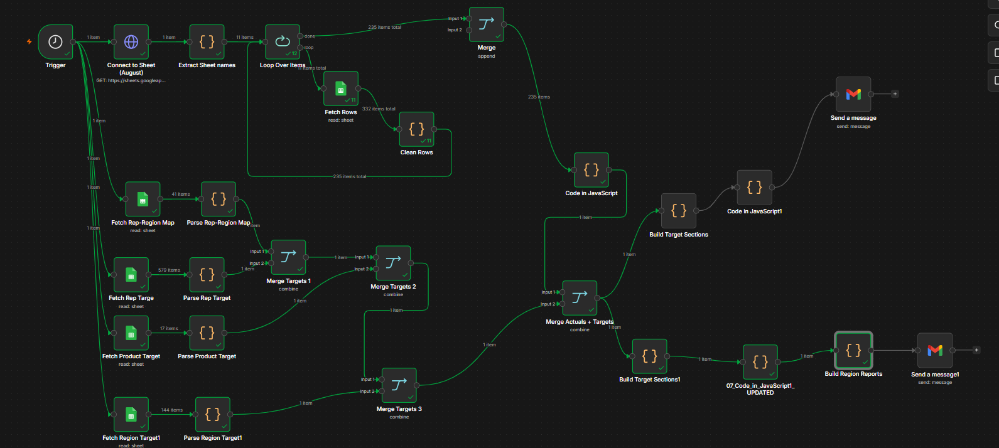

# Automated Sales Performance & Target Tracking Pipeline
**Tools:** n8n | Google Sheets | JavaScript
**Type:** Production-Grade Automated Reporting
**Industry:** Pharmaceutical Distribution

## Project Overview
Built a sophisticated automated reporting 
pipeline for a pharmaceutical distribution 
company that dynamically extracts sales 
actuals across multiple regions, merges 
them against rep, product and regional 
targets, and delivers formatted executive 
performance reports via email — completely 
automatically on schedule.

## Business Problem
The sales and operations team spent 
several hours every week:
- Manually opening 11 different Google Sheets
- Copying sales actuals by region and rep
- Comparing against individual rep targets
- Comparing against product targets
- Comparing against regional targets
- Writing and sending performance reports

This pipeline eliminated all of that 
manual work completely.

## Workflow Architecture
Trigger (Schedule)
↓
Connect to Google Sheet
↓
Extract Sheet Names dynamically
↓
Loop Over 11 Sheets automatically
↓
Fetch Rows (291 items)
↓
Clean Rows (206 items)
↓
Parallel target extraction:
├── Fetch Rep-Region Map (41 items)
├── Fetch Rep Targets (579 items)
├── Fetch Product Targets (17 items)
└── Fetch Region Targets (144 items)
↓
Merge Targets 1, 2, 3 (combine)
↓
Merge Actuals + Targets
↓
Build Target Sections
↓
JavaScript transformations × 3
↓
Send Executive Report × 2 (Gmail)

## What Makes This Advanced
- **Dynamic sheet looping** — automatically 
  detects and loops through all 11 sheets
- **Multi-source target merging** — combines 
  rep, product and regional targets in one pipeline
- **Actuals vs targets comparison** — calculates 
  performance gap automatically
- **Dual email output** — sends two separate 
  formatted reports to different recipients
- **Production grade** — runs live in a real 
  pharmaceutical distribution company

## Key Metrics Processed
Sales Sheets: 11 dynamic sheets
Sales Actuals: 206 clean rows
Rep Targets: 579 items
Rep-Region Map: 41 mappings
Product Targets: 17 product lines
Region Targets: 144 regional targets

## Skills Demonstrated
- n8n advanced workflow design
- Dynamic looping and iteration
- Google Sheets API integration
- Multi-source data merging
- JavaScript data transformation
- Target vs actual performance analysis
- Automated executive reporting
- Production deployment
  
## Workflow Preview

